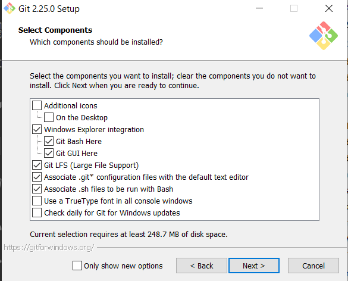

# Exercice 2

## Objectif
L'objectif de cet exercice est de configurer un environnement GIT prêt à l'emploi sous windows

---

**Tâche préliminaire**
1) Pour affichier correctement ce fichier veuillez télécharger vscode ici : https://code.visualstudio.com/docs/?dv=win

2) un fois installer, ouvrez ce dossier. 
3) dans "l'explorer" de vscode, clic-droit sur le fichier, puis "open pre iew"

---

**Tâche 1 :  Téléchargez Git for Windows**

1) Depuis l'url [git for window](https://gitforwindows.org/)
2) ou directement [Version 2.25 / 64bits](https://github.com/git-for-windows/git/releases/download/v2.25.0.windows.1/Git-2.25.0-64-bit.exe)


**Tâche 2 : Installation**

1) lancez l'installation

2) 
3) 
4) 
5) ici, n'oubliez pas de préciser l'option 'Checkout as-is, commit as-is' 
6) 
7) 
8) à la dernière étape, en cochant la case 'launch git', et en tapant 'git --version', vous devez obtenir ceci


**Tâche 3 : Configuration de votre nom et prénom** 

Configurez votre nom et prénom
``` 
Git config --global user.name "Jeremie Loscos"
```

**Tâche 4: Configuration de votre email**
```
Git config --global user.email "jeremie.loscos@expaceo.com"
```

**Tâche 5 : Installez VSCode**
1) Pour editer vos gitconfig et plus encore, Installez vscode.
    [Téléchargez le ici](https://code.visualstudio.com/docs/?dv=win)

**Tâche 6 : Installez VSCode**

1) Clicquez sur l'icone des extensions

 

2) tapez 'git' dans la zone de recherche

 

3) Installez Git history
4) Installez Git Lens
5) Installez Git Graph


**Tâche 7 : Editez la configuration globale de git**
```
code ~/.gitconfig
```
1) Constatez que vos nom/prénom, email sont présent dans ce fichier sous la section **[user]**

2) Ajouter la section, s'il celle-ci n'est pas présente 
```
[core]
  	editor = \"C:\\Users\\jeremie.loscos\\AppData\\Local\\Programs\\Microsoft VS Code\\Code.exe\" --wait
```
cette section permet d'utiliser vscode pour le message des commit en lieu et place de l'éditeur par défaut (vim)


## Résultat

1) La console s'est ouverte est la version de de git est >= à 2.25
2) Dans l'explorateur windows vous devez avoir dans le menu contextuel ces 2 menus

    

3) Visual Studio Code est installer ainsi que 3 extensions pour manipuler Git
