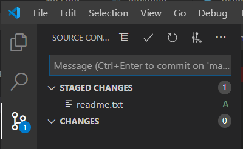
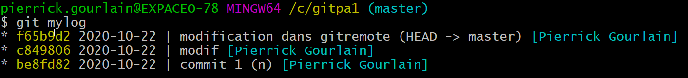

# Exercice 4

## Objectif
L'objectif de cet exercice est de manipuler les commandes de bases de git. Ainsi créer votre première histoire dans un dépôt.

## votre premier commit
**Tâche 1 : ajoutez un fichier readme.txt**
```
$ cd /c/GITZZ1
$ git log
fatal: your current branch 'master' does not have any commits yet

$ echo bonjour > readme.txt

$ git status
On branch master

No commits yet

Untracked files:
  (use "git add <file>..." to include in what will be committed)
        readme.txt

nothing added to commit but untracked files present (use "git add" to track)
```
à ce stade le fichier nouvellement créer n'est pas "commité"

```
$ git add .
```
ajoute l'ensemble des fichiers présent dans git 'en staged'.

```
$ git status
On branch master

No commits yet

Changes to be committed:
  (use "git rm --cached <file>..." to unstage)
        new file:   readme.txt
```

en ajoutant '-v' on obtient :
```
$ git status -v
On branch master

No commits yet

Changes to be committed:
  (use "git rm --cached <file>..." to unstage)
        new file:   readme.txt

diff --git a/readme.txt b/readme.txt
new file mode 100644
index 0000000..1cd909e
--- /dev/null
+++ b/readme.txt
@@ -0,0 +1 @@
+bonjour

```
En utilisant un outil telque VSCode, vous pouvez constater que le fichier est en staged



**Tâche 2 : git commit**

Pour créer un premier noeud dans git, il suffit de  :

```
$ git commit -m "mon premier commit"
[master (root-commit) 2a5904c] mon premier commit
 1 file changed, 1 insertion(+)
 create mode 100644 readme.txt
```
désormais git status renvoi :

```
$ git status
On branch master
nothing to commit, working tree clean
```

**Tâche 3 : Modifier le fichier**
Ajoutez un ligne dans le fichier readme.txt en utilisant vscode

//TODO: git diff

Validez les modifications
```
$ git commit -a -m "Ajout de tout le monde"
```

**Tâche 4 : voir l'historique**
Afficher l'historique, c'est voir les modifications réalisées sur le dépôt.
```
$ git log
commit 2f7884a39bee2956dcfc6347ea3e2d1aa7a81e98
Author: Jeremie Loscos <jeremie.loscos@expaceo.com>
Date:   Sun Feb 23 22:25:09 2020 +0100

    Ajout de tout le monde

commit 2a5904c55c3a1fe53a1e333add8b48660267e568
Author: Jeremie Loscos <jeremie.loscos@expaceo.com>
Date:   Sun Feb 23 21:37:10 2020 +0100

    mon premier commit
```

Pour plus d'options essayez
```
$ git log --oneline --decorate --graph --all
* e90c931 (HEAD -> master) ajout de gitignore
* 2f7884a Ajout de tout le monde
* 2a5904c mon premier commit
```

et pour connaitre les options de git log, utilisez 
```
$ git log --help
```

**Tâche 5 : Utilisez Gitk**
```
$ gitk
```
vous naviguer ainsi dans le même historique de manière graphique.


**Tâche 6 : ajouter un fichier .gitignore**
Le fichier '.gitignore' vous permet d'indiquer à git.exe la liste des fichiers/dossiers qu'il doit ignorer. Typiquement il est commun d'exclure des répertoires telsque '.vs', '.vscode' (répertoires associés à certains éditeurs de code)

```
$ echo "untracked" > .gitignore
$ git add .
$ git commit -m "ajout de gitignore"
[master e90c931] ajout de gitignore
 1 file changed, 1 insertion(+)
 create mode 100644 .gitignore
```

Ajoutons maintenant un fichier readme.txt dans le répertoire untracked
```
$ mkdir untracked
$ cd untracked
$ echo "coucou" > readme.txt
$ git status
On branch master
nothing to commit, working tree clean
```

Ensuite 
```
$ cd ..
$ mv untracked tracked
$ git status
On branch master
Untracked files:
  (use "git add <file>..." to include in what will be committed)
        tracked/

nothing added to commit but untracked files present (use "git add" to track)
```
le dossier 'untracked est bien ignoré par git

# Optionnel

utilisez VSCode et le plugin gitlens, et observer votre historique.

**Tâche 7 : git alias**
Si vous êtes amener à utiliser la ligne de commande plutôt qu'un outil tiers (vscode, tortoisegit,...). Définir des alias vous sera d'un grand secours pour améliorer votre productivité avec git.

```
$ git config --global alias.unstage 'reset HEAD --'
$ echo "coucou" > readme.txt
$ git add readme.txt
$ git status
$ git unstage readme.txt
$ git status
$ git add readme.txt
$ git restore --staged readme.txt
```

**Tâche 8 : git log avec des couleurs customs**

1) réalisez un alias qui donne ceci :



# FAQ
Pensez à afficher tous les fichiers sous windows. Par défaut .gitignore est masqué.
sous gitbash, pour voir tous les fichiers
```
ls -al

```

# Résulat
Vous devez maintenant avoir un dépôt avec une historique
Nous avons vu :
- git add
- git commit -m "message"
- git status
- git log
- gitk
- le fichier .gitignore
