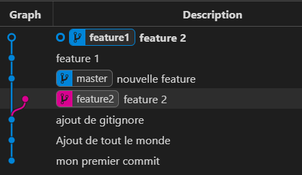

# Exercice 5

## Objectif
L'objectif de cet exercice est de manipuler les principales commandes Git de gestion des branches. (création, fusion, comparaison).


**Tâche 1: la branche master/lister les branches**
Par defaut une branche 'master est créer à la création du dépôt. 

```
$ git branch
* master
```

**Tâche 1.1 : commit du fichier readme precedemment annuler**
```
$ git add .
$ git commit -m "Ajout du fichier readme"
```
à ce stade dans master vous devez avoir une fichier readm.txte présent dans la branche master


**Tâche 2 : création d'une branche**
La création d'une branche se fait via 'git branch 'nom de ma branche'

```
$ git branch feature1
```

Ensuite, affichez la liste des branches
```
$ git branch
  feature1
* master
```


**Tâche 3 : Effectuez un modification dans la nouvelle branche**

```
$ git checkout feature1
Switched to branch 'feature1'
$ echo "feature1" > readme.txt
$ git diff

diff --git a/readme.txt b/readme.txt
index f5acb0f..466b0cc 100644
--- a/readme.txt
+++ b/readme.txt
@@ -1,2 +1 @@
-bonjour
-Tout le monde
+feature1

$ git add readme.txt
$ git commit -m "feature 1"
[feature1 9f1abf2] feature 1
 1 file changed, 1 insertion(+), 2 deletions(-)
```

il existe un raccouci pour à la fois créer un branche et basculer dessus. Rebasculer tout d'abord sur master
```
$ git checkout master
```
Ensuite crez une nouvelle branche feature2 et basculez dessus directement
```
$ git checkout -b feature2
$ echo "feature 2" > readme.txt
$ git add readme.txt
$ git commit -m "feature 2"
```
**Tâche 7 : affiche le log de toutes les branches**

```
$ git log --oneline --decorate --graph --all
* 2559a93 (HEAD -> feature2) feature 2
| * 9f1abf2 (feature1) feature 1
|/
* e90c931 (master) ajout de gitignore
* 2f7884a Ajout de tout le monde
* 2a5904c mon premier commit
```

Testez avec vscode et le plugin gitgraph


**Tâche 6 : création d'une branche de branche**
```
$ git checkout -b feature2.1
$ echo "feature 2.1" > readme.txt
$ git add readme.txt
$ git commit -m "feature 2.1"
```

**Tâche 6 : comparez 2 branches**
Vous avez vu que git diff permet d'afficher les différences. Vous pouvez ajouter des argulments pour comparer 2 branches
```
$ git diff feature2..feature2.1
diff --git a/readme.txt b/readme.txt
index 7268a88..e0c2a61 100644
--- a/readme.txt
+++ b/readme.txt
@@ -1 +1 @@
-feature 2
+feature 2.1...
```

**Tâche 7 : Suppression d'une branche**
A noter que vous ne pouvez jamais suppression la branche active
```
$ git checkout master
$ git branch -D feature2.1 
```
Si vous utilisez l'option -d (minuscule), la branche ne doit pas posseder de modifications qui risque d'être perdues. -D force la suppression


**Tâche 8 : gestion des conflits**
Comme vous avez modifié le même fichier et la même ligne dans ce fichier. il faut maintenant résoudre le
```
$ git checkout feature1
$ git merge feature2
Auto-merging readme.txt
CONFLICT (content): Merge conflict in readme.txt
Automatic merge failed; fix conflicts and then commit the result.

jeremie.loscos@EXPACEO-80 MINGW64 /c/GITZZ1 (feature1|MERGING)
```
Remarquez l'état de la branche (MERGING). c'est a vous maintenant de terminer le travail de merge et de validez les modifications

**résoudre le conflits**
Plusieurs options s'offre à vous
- ligne de commande git mergetool

un editeur recent qui gère visuellement les conflits.
- vscode

option 1 : (pour les personnes manupilant vi)
```
$ git mergetool

This message is displayed because 'merge.tool' is not configured.
See 'git mergetool --tool-help' or 'git help config' for more details.
'git mergetool' will now attempt to use one of the following tools:
opendiff kdiff3 tkdiff xxdiff meld tortoisemerge gvimdiff diffuse diffmerge ecmerge p4merge araxis bc codecompare smerge emerge vimdiff
Merging:
readme.txt

Normal merge conflict for 'readme.txt':
  {local}: modified file
  {remote}: modified file
Hit return to start merge resolution tool (vimdiff): 
```

option 2 : 
```
$ code readme.txt
```


**validez la résolution**

une fois que vous avez choisi votre option et corrigé le fichier readme.txt
```
$ git add readme.txt
$ git merge --continue
hint: Waiting for your editor to close the file...
[feature1 bc55ae1] Merge branch 'feature2' into feature1
```
à noter que pendant le merge vous devez entrez un message qui concerne le résultat du merge. L'éditeur de texte pour saisir le message du commit peut être différent. En effet il dépends de votre paramétrage global de git(~/.gitconfig, section [core])

# Optionnel

**Tâche 9 : rebase branch**
Le rebase est une opération très pratique pour récupérer les fonctionnalités d'une branche sans merge votre branche (on considère que votre travail n'est pas encore terminé).
Comme expliqué dans le cours le principe est de "rejouer" vos commits après l'ensemble des commits de la branche de base. Ce qui donne que vos modifications viennent après les modifications de la branche de base.
Exemple : feature1 possède 2 commits d'avance sur master


**faisons avancer master**
```
$ git checkout master
$ echo "autre feature" > readme1.txt
$ git add readme1.txt
$ git commit -m "nouvelle feature"
```


Remarquez que 'master' est désormais en avance d'un commit
Imaginons que nous pour continuer 'feature1' nous avons besoin des modifications de 'master'.
procédez au rebase

```
$ git checkout feature1
$ git rebase master
First, rewinding head to replay your work on top of it...
Applying: feature 1
Applying: feature 2
Using index info to reconstruct a base tree...
M       readme.txt
Falling back to patching base and 3-way merge...
Auto-merging readme.txt
CONFLICT (content): Merge conflict in readme.txt
error: Failed to merge in the changes.
hint: Use 'git am --show-current-patch' to see the failed patch
Patch failed at 0002 feature 2
Resolve all conflicts manually, mark them as resolved with
"git add/rm <conflicted_files>", then run "git rebase --continue".
You can instead skip this commit: run "git rebase --skip".
To abort and get back to the state before "git rebase", run "git rebase --abort".
```
Ce resultat est tout à fait logique. En effet en réintégrant vos modifications au dessus de celle de master le fichier readme.txt est en conflit, puisqu'il à été modifié dans les 2 branches. La résolution est identique au merge précédent.

**Corrigez les conflits, puis**
```
$ git add readme.txt
$ git rebase --continue
Applying: feature 2
```


/!\ le rebase est une opération pratique, mais qu'il ne faut utiliser que lorsque votre branche est locale (non poussé sur un dépôt distant)

**Tâche 10 :**

Ajouter 9 fichiers en 9 commits dans une branche "feature3", comme la figure ci-dessous :


En utilisant ce que nous avons vu, faites en sorte de réécrire votre histoire git comme ceci :


c'est à dire 1 commit avec les 9 fichiers.


# Résulat
(avant la tâche 10) Vous devez maintenant avoir 3 branches
```
$ git branch
* feature1
  feature2
  master
```
