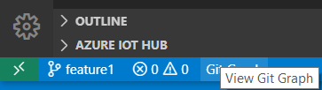
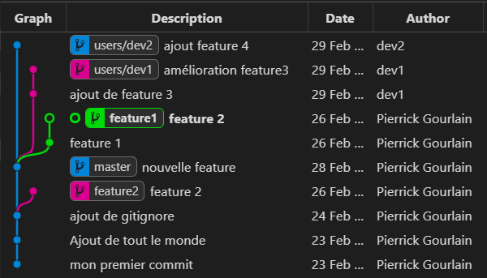
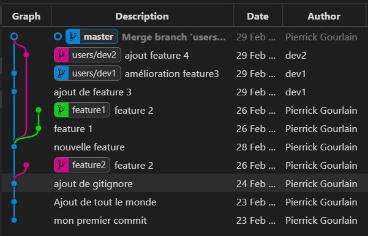
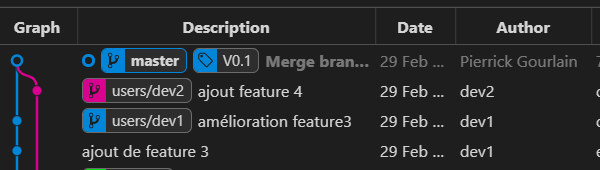
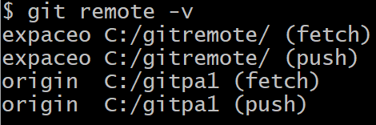
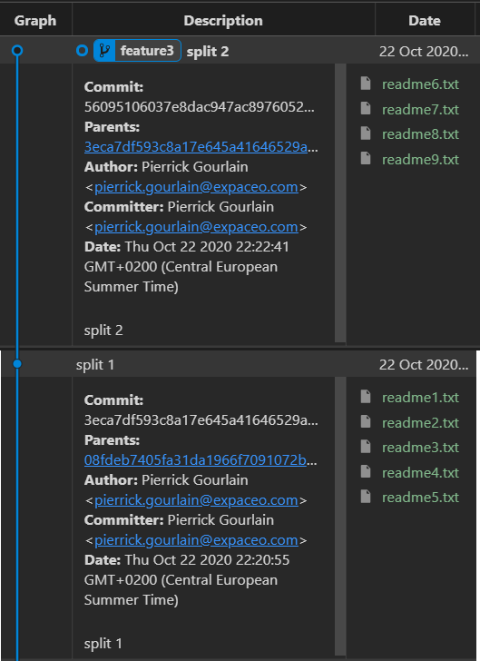

# Exercice 6

## Objectif
Mise en place d'un dépôt distant et simulation d'un travail collaboratif.
dans votre simulation, 
- le dépôt distant sera /c/GITZZ1
- le dévelopeur 1 sera /c/dev1
- le dévelopeur 2 sera /c/dev2


**Tâche 1 : mise en place des dépôts à partir de GITZZ1**
```
$ cd /c
$ git clone /c/GITZZ1 dev1
$ git clone /c/GITZZ1 dev2
```

**Tâche 2 : baculer sur  dev1**
```
$ cd /c/dev1
$ git log -1 HEAD
$ git log -1 HEAD
commit 0bcbb15520315d46398fc618ee104da9a3040421 (HEAD -> feature1, origin/feature1, origin/HEAD)
Author: Jeremie Loscos <jeremie.loscos@expaceo.com>
Date:   Wed Feb 26 21:56:13 2020 +0100
```
Verifiez que dev1 est bien relié à GITZZ1
```
$ git remote -v
origin  C:/GITZZ1/ (fetch)
origin  C:/GITZZ1/ (push)
```

**Tâche 3 : paramétrage du nom du développeur**
```
$ git config --local user.name "dev1"
$ git config --local user.email "dev1@expaceo.com"
```

**Tâche 4 : Créez une nouvelle fonctionnalité**
```
$ git checkout master
$ git checkout -b users/dev1
$ echo "feature3" > feature3.txt
$ git add feature3.txt
$ git commit -m "ajout de feature 3"
```

Vérifiez que c'est bien dev1 qui a effectué la modification
```
$ git log --format="%h %an %s"
ee6ee29 dev1 ajout de feature 3
ce83fa7 Jeremie Loscos nouvelle feature
e90c931 Jeremie Loscos ajout de gitignore
2f7884a Jeremie Loscos Ajout de tout le monde
2a5904c Jeremie Loscos mon premier commit
```

**Tâche 5 : pousser la nouvelle branche dans le dépôt distant**

il existe 2 cas
- la branche existe sur le dépôt distant
- la branche n'existe pas

pour le savoir
```
$ git ls-remote
From C:/GITZZ1/
0bcbb15520315d46398fc618ee104da9a3040421        HEAD
0bcbb15520315d46398fc618ee104da9a3040421        refs/heads/feature1
2559a93561f921a0963c440cb9793923c6b747df        refs/heads/feature2
ce83fa71b22ae21dbfa247806b1c20643fa475af        refs/heads/master
```

elle n'existe pas...
```
$ git push --set-upstream origin users/dev1
Enumerating objects: 7, done.
Counting objects: 100% (7/7), done.
Delta compression using up to 8 threads
Compressing objects: 100% (4/4), done.
Writing objects: 100% (6/6), 578 bytes | 578.00 KiB/s, done.
Total 6 (delta 1), reused 0 (delta 0)
To C:/GITZZ1
 * [new branch]      users/dev1 -> users/dev1
Branch 'users/dev1' set up to track remote branch 'users/dev1' from 'origin'.


$ git ls-remote
From C:/GITZZ1
0bcbb15520315d46398fc618ee104da9a3040421        HEAD
0bcbb15520315d46398fc618ee104da9a3040421        refs/heads/feature1
2559a93561f921a0963c440cb9793923c6b747df        refs/heads/feature2
ce83fa71b22ae21dbfa247806b1c20643fa475af        refs/heads/master
21c78a47d3c63716481845806bc4c591d6ba4508        refs/heads/users/dev1

```

**Tâche 6 : amélioration de feature3**
Modifiez le fichier feature3.txt en ajoutant une ligne, dans le fichier, ensuite :
```
$ git add feature3.txt
$ git commit -m "amélioration feature3"
[users/dev1 21c78a4] amélioration feature3
 1 file changed, 1 insertion(+)
```

maintenant pour mettre à jour le dépôt GITZZ1, il suffit de faire 
```
$ git push
Enumerating objects: 5, done.
Counting objects: 100% (5/5), done.
Delta compression using up to 8 threads
Compressing objects: 100% (2/2), done.
Writing objects: 100% (3/3), 287 bytes | 287.00 KiB/s, done.
Total 3 (delta 1), reused 0 (delta 0)
To C:/GITZZ1
 + 21c78a4...d7de8e6 users/dev1 -> users/dev1
```

**Tâche 7 : Passer sur le dépôt dev2**

Récupérer le travailler poussé par dev1
```
$ cd /c/dev2
$ git checkout master
$ git pull
remote: Enumerating objects: 7, done.
remote: Counting objects: 100% (7/7), done.
remote: Compressing objects: 100% (4/4), done.
remote: Total 6 (delta 1), reused 0 (delta 0)
Unpacking objects: 100% (6/6), 558 bytes | 22.00 KiB/s, done.
From C:/GITZZ1
 * [new branch]      users/dev1 -> origin/users/dev1
Already up to date.
```
une nouvelle branche est apparue dans le dépôt dev2

Regardez le log de la branche
```
$ git checkout users/dev1
$ git log --format="%h %an %s"
d7de8e6 dev1 amélioration feature3
ee6ee29 dev1 ajout de feature 3
ce83fa7 Jeremie Loscos nouvelle feature
e90c931 Jeremie Loscos ajout de gitignore
2f7884a Jeremie Loscos Ajout de tout le monde
2a5904c Jeremie Loscos mon premier commit

```

**Tâche 8 : paramétrage du nom du développeur**
```
$ git config --local user.name "dev2"
$ git config --local user.email "dev2@expaceo.com"
```

**Tâche 8 : ajoutez le 'travail' de dev2**
```
$ git checkout master
$ git checkout -b users/dev2
$ echo "ajout feature 4" > feature4.txt
$ git add feature4.txt
$ git commit -m "ajout feature 4"
[users/dev2 d10c58e] ajout feature 4
 1 file changed, 1 insertion(+)
 create mode 100644 feature4.txt
```

comme pour dev1, il faut pousser la branche sur le dépôt distant
```
$ git push --set-upstream origin users/dev2
Enumerating objects: 4, done.
Counting objects: 100% (4/4), done.
Delta compression using up to 8 threads
Compressing objects: 100% (2/2), done.
Writing objects: 100% (3/3), 365 bytes | 365.00 KiB/s, done.
Total 3 (delta 0), reused 0 (delta 0)
To C:/GITZZ1
 * [new branch]      users/dev2 -> users/dev2
Branch 'users/dev2' set up to track remote branch 'users/dev2' from 'origin'.
```

Maintenant le dépôt GITZZ1 contient les modification de dev1 et dev2
regardez le graph
```
$ cd /c/GITZZ1
$ code .
```
afficher ensuite le graph de git



Le graphique nous indique clairement le travail de chacun



Il vous reste maintenant à fusion ce travail depuis le dépôt principal(GITZZ1)
```
$ git switch master
$ git merge users/dev1 -m "Merge dev1"
Updating ce83fa7..d7de8e6
Fast-forward
 feature3.txt | 2 ++
 1 file changed, 2 insertions(+)
 create mode 100644 feature3.txt

$ git merge users/dev2 -m "Merge dev2"
```
Ce qui donne visuellement :



Et pour terminer vous pouvez tagger l'intégration de vos développement via git tag
```
$ git tag 'V0.1'
```


un tag et ainsi posé qui pourra être utilisé plus tard pour repérer dans l'historique vos livraisons


# Optionnel

**Tâche 9 : configurer plusieurs remotes**

1) En utilisant /c/GITZZ1 et un nouveau repo /c/gitremote et y insérer un nouveau commit

2) Creez un troisième repo /c/gitmremote qui sera relié aux 2 précédents, comme ci-dessous



3) Ensuite ajouter un commit dans /c/gitremote
4) récupérer le dans /c/gitmremote et fusion avec votre master
5) pousser le tout dans /c/GITZZ1
 

 **Tâche10 : splitter un commit**
 1) reprenez la tâche optionnel 10 de l'exercice 5
 2) splitter le commit contenant les 9 fichiers en 2

 
 

# Résultat
Vous avez vu les commandes pour manipuler des dépôt distants
- git clone [url_du_dépôt_distant] [répertoire]
- git push --set-upstream origin users/dev1
- git push
- git pull
- git tag 


