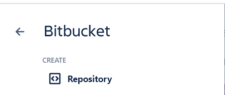
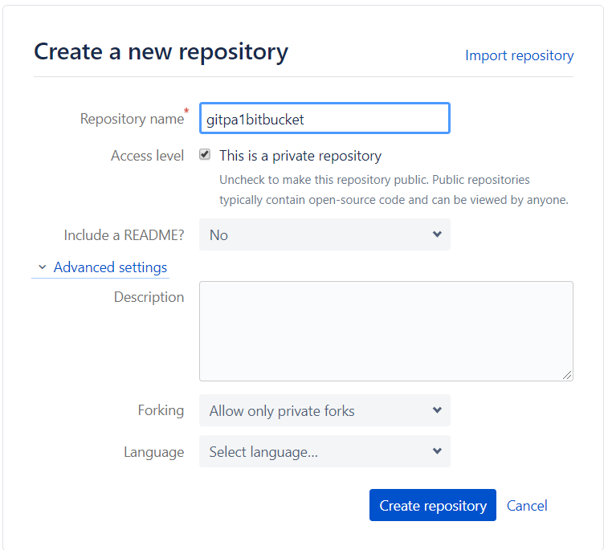
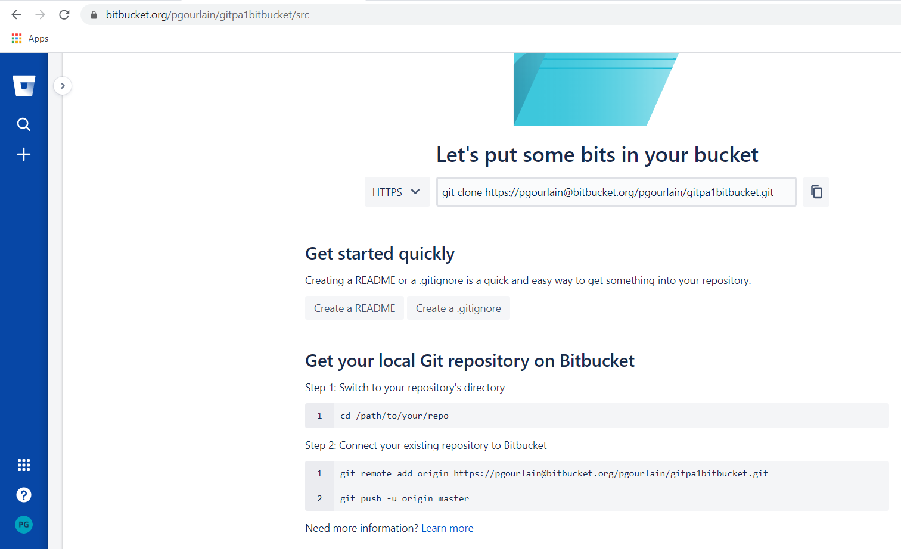

# Exercice 7


## Objectif

Pour Bitbucket :
- voir section Bitbucket

Pour Gitlab
- voir la section Gitlab


### Gitlab

** Tâche 1 : Le formateur vous attribue un numéro de dépôt **

** Tâche 2 : créer / initialiser votre dépôt **

```
$ cd /c/
$ git -c http.sslVerify=false clone https://gitlab.northeurope.cloudapp.azure.com/gitlab-instance-18225c4d/GITZZ1-XX.git

```

si votre dépot local existe déjà

```
cd existing_repo
git remote add origin https://gitlab.northeurope.cloudapp.azure.com/gitlab-instance-18225c4d/GITZZ1-xxx.git
git branch -M main
git push -uf origin main
```


### BitBucket

**Tâche 1 : creez votre compte si besoin**
- suivez les étapes pour créer un compte sur bitbucket

**Tâche 2 : creer un dépôt**

Cliquez sur '+'


cliquez sur Repository



Entrez un nom et cliquez sur 'create repository'


Le résultat



**Tâche 3 : cloner ce dépôt distant**
```
$ cd /c/
$ git clone https://xxxx@bitbucket.org/xxxx/GITZZ1bitbucket.git
Cloning into 'GITZZ1bitbucket'...
warning: You appear to have cloned an empty repository.
```
/!\ remplacer 'xxxx' par le nom de votre bitbucket


```
$ cd /c/GITZZ1bitbucket
$ git remote -v
origin  https://xxxx@bitbucket.org/xxxx/GITZZ1bitbucket.git (fetch)
origin  https://xxxx@bitbucket.org/xxxx/GITZZ1bitbucket.git (push)
```
le dépôt actuel est bien relié à votre bitbucket. Vous pouvez travailler en équipe !!

# Résultat
Vous avez vu comment créer un dépôt en ligne (ici bitbucket)

