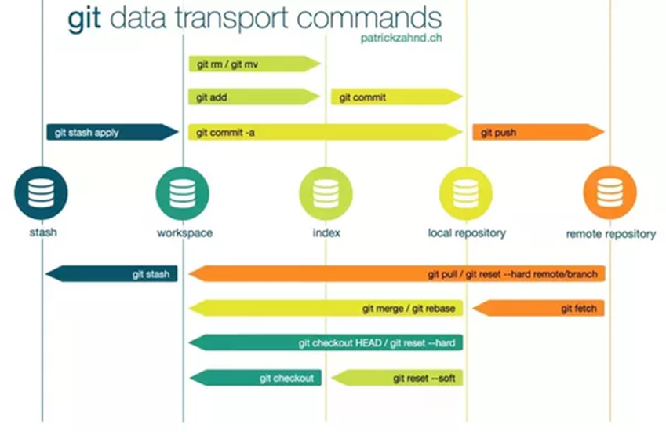

# L'architecture des commandes git



# quelques commandes Git

Recherche un texte

```
git rev-list --all | xargs git grep -F 'bonjour'
```

```
git log --oneline –decorate 
git log --oneline --decorate --graph --all 
```

rechercher un commit perdue
```
git reflog --decorate=full --pretty=%H | xargs git grep -F 'mon text'
```
